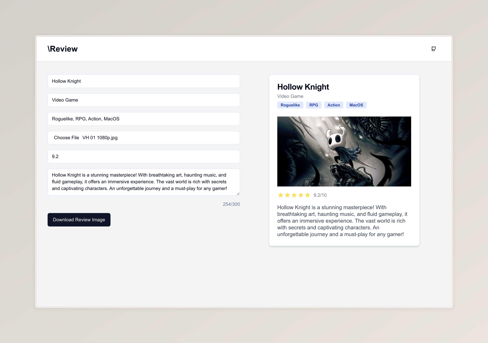

## \Review

A review app built entirely by AI in an hour. Create an image card containing your personal review of a movie or a video game using this app and share it to your social media as you like.

Check it out here: [https://slash-review.vercel.app/](https://slash-review.vercel.app/)

Built with Claude AI.

### Technologies

### How to run

- Clone this repository to your local system.
- cd to the project directory on terminal and type `npm install` followed by `npm run dev`
- Go to url: http://localhost:3000 in your browser to check out the app.

### Preview

  

### Support Development

